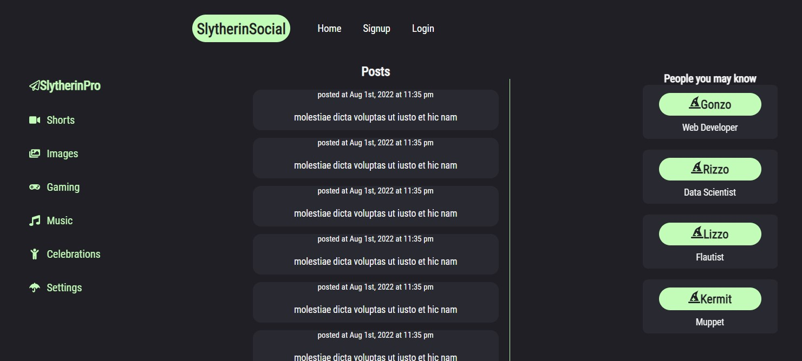
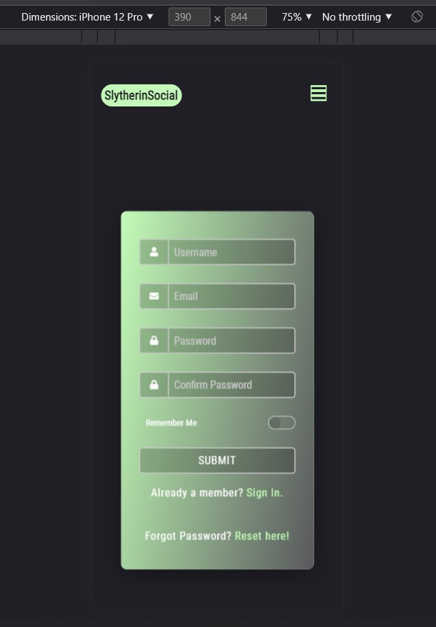
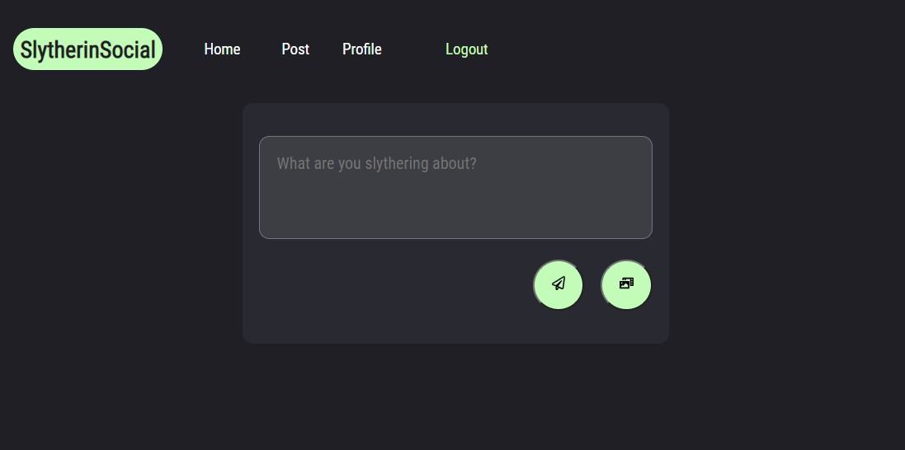

    

    

# A social media platform built using MERN stack. 

Currently at an MVP stage of development. Create an account, create and view posts, add friends.

### Deployed site ✅
https://slytherin-social.herokuapp.com/

### Built with ⚡

-  GraphQL
-  Node.js
-  Express.js
-  CSS / Styled Components
-  React
-  MongoDB and Mongoose ODM
-  Node
-  Heroku
-  JSON Web Tokens

## Some available Scripts ⭐

In the root of the project directory, you can run:

### `npm install`
Install dependencies for both server and client 

### `npm run seed`
Populates the database with some faux users/ posts/ friends. 

### `npm run develop`

Runs just the client and server app using concurrently in development mode. 
Open [http://localhost:3000](http://localhost:3000) to view the client in the browser.

## File structure 🌿
#### `client` - Holds the client application
- #### `public` - This holds all of our static files
- #### `src`
    - #### `components` - This folder holds all of the different components that will make up our views
    - #### `utils` - Holds mutations and queries for GraphQL and controls for our JWT's
    - #### `App.js` - This is what renders all of our browser routes and different views
    - #### `index.js` - This is what renders the react app by rendering App.js, should not change
    - #### `reportWebVitals.js` - Measures a set of metrics that aim to capture the user experience of a web page
- #### `package.json` - Defines npm behaviors and packages for the client
#### `server` - Holds the server application
- #### `config` - This holds our configuration files, like mongoDB uri
- #### `models` - Holds all of our data models
- #### `seeders` - Sample data in json format to faux-populate the database
- #### `schemas` - Defines the structure and content of our data
- #### `utils` - For token authorization and defining dates/times
#### `package.json` - Defines npm behaviors like the scripts defined in the next section of the README
#### `.gitignore` - Tells git which files to ignore
#### `README` - This file!

## Motivation 🌻

We wanted to undertake an expansive and open ended project that would require continued development.

### Contributors 👨‍💻
- Jessica Chen | https://github.com/jess-n-chen
- Justin Mare | https://github.com/jpmare29
- Thomas McGovern | https://github.com/TMcG1998
- Ross Thomson | https://github.com/rthomson412
- Jeffrey Wang | https://github.com/SplitRabbit

### Screenshots 📺

